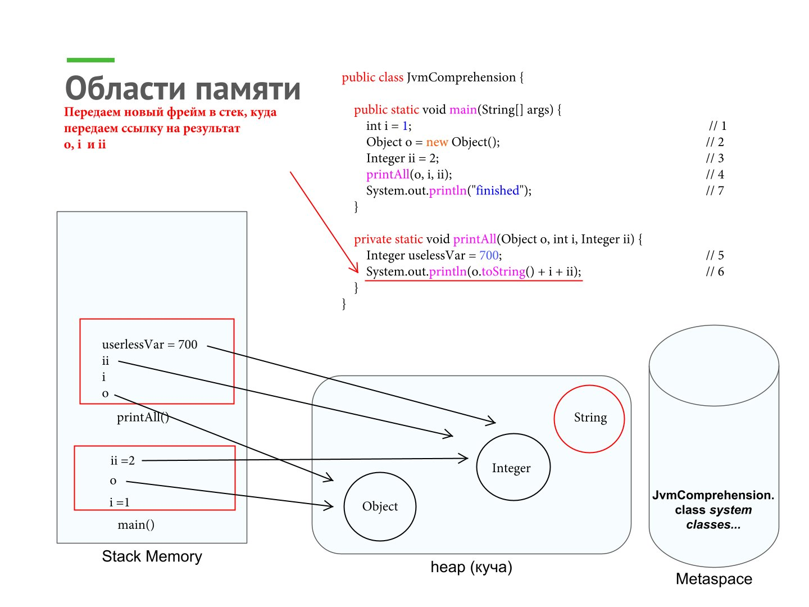

# Задача "Понимание JVM"

```java

public class JvmComprehension {

    public static void main(String[] args) {
        int i = 1;                      // 1
        Object o = new Object();        // 2
        Integer ii = 2;                 // 3
        printAll(o, i, ii);             // 4
        System.out.println("finished"); // 7
    }

    private static void printAll(Object o, int i, Integer ii) {
        Integer uselessVar = 700;                   // 5
        System.out.println(o.toString() + i + ii);  // 6
    }
}

```


## ClassLoader'ы

- В исходном коде идет анализ классов, обнаруживаем новый класс `JvmComprehension` и на этапах Application ClassLoader, Platform ClassLoader, Bootstrap ClassLoader подсистема загрузчиков классов его найдет и подгрузит;

- Дальше происходит иниициализация класса: выполняются static инициализаторы.

## [Этапы в области памяти](https://github.com/neo7976/Java-4-Homeworks-Java-Core-10-1/blob/main/file/%D0%94%D0%97%20-%20%D0%B2%D1%81%D0%B5%20%D1%8D%D1%82%D0%B0%D0%BF%D1%8B.pdf)

- Наш исходный код 

 
- Происходит добавление JvmComprehension в Metaspace

   
- Создается `main()` в стеке

 
- Создается переменная `i` в main()
 

- Создаем `Object` в heap (куче)
 

- Создается переменная `o` в main() с сылкой на `Object`
 

- Создаем `Integer` в heap (куче)
 

- Создается переменная `ii` в main() с сылкой на `Integer`
 

- Создается `printAll()` в стеке


- Создается переменная `o`, `ii` и `i` в printAll() с ссылкой на `Object` `Integer` соответственно
 

- Создается переменная `userlessVar` в printAll() с ссылкой на `Integer`
 

- Передаем новый фрейм в стек, куда передаем ссылку на результат `о`, `i` и `ii`
 

- Передаем новый фрейм в стек и выводим сообщение об окончании выполняемой программы
 


## Сборщик мусора

Сборка периодечески собирает объекты из памяти (хипа), которые больше не используются. В какой момент времени это произойдет - не известно.

